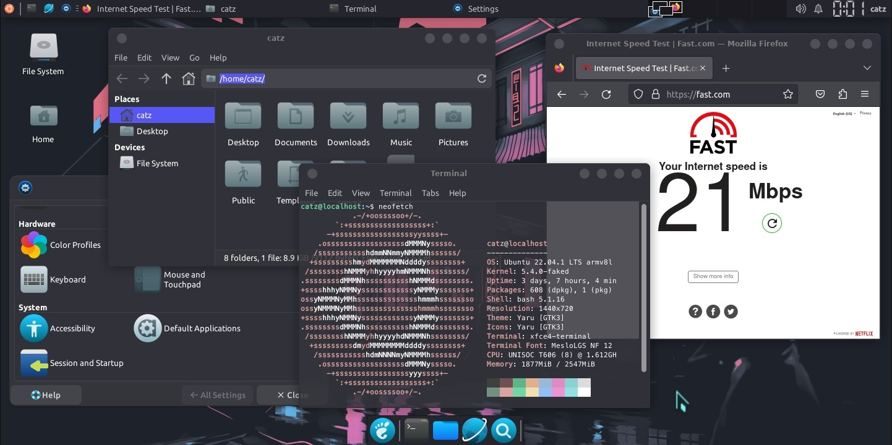
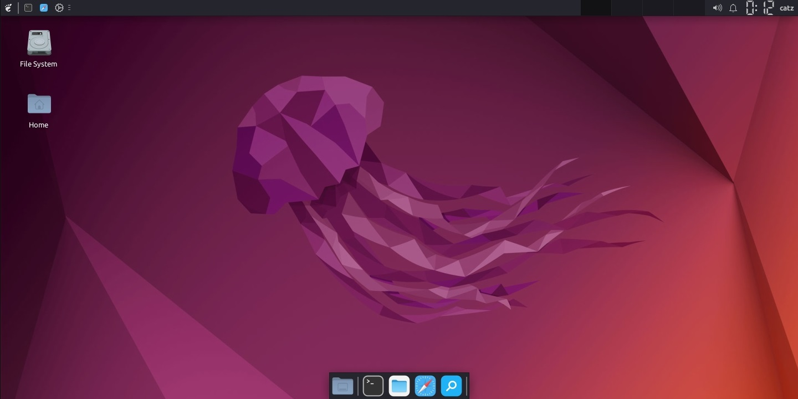

<p align="center">

</p>
<p align="center">


</p>
<p align="center">


</p>
<p align="center"><b>Run Ubuntu MAX on your termux with much features.</b></p>

### Features

- Fixed Audio Output
- Lightweight {Requires at least 4GB Storage}
- 2 Browsers (Chromium & Mozilla Firefox)
- Supports Bangla Fonts
- VLC Media Player and MPV media player
- Visual Studio Code (buggy on arm )
- Sublime Text Editor (only for arm64/aarch64)
- Easy for Beginners
- Comes with some cool themes.

### Installation
- Firstly install [Termux](https://termux.com) apk from [HERE](https://f-droid.org/repo/com.termux_118.apk)
- Secondly Clone the Repository & Run the setup File

  - `yes | pkg up`
  - `pkg install git wget -y`
  - `git clone --depth=1 https://github.com/akash-max4x-account/MAX-UBUNTU.git`
  - `cd MAX-UBUNTU`
  - `bash setup.sh`

- Then Restart your Termux & Type the following commands

   - `ubuntu`
   - `bash user.sh`

- Type your ubuntu root username. Must be lowercase & no space included.

- Then Again Restart your Termux & Type the following commands

   - `ubuntu`
   - `sudo bash gui.sh`

- **You have to note your VNC password !!**

- Ubuntu image is now successfully installed .

  - Type `vncstart` to run Vncserver
  - Type `vncstop` to stop Vncserver

- Install VNC VIEWER Apk on your Device. [Google Play Store](https://play.google.com/store/apps/details?id=com.realvnc.viewer.android&hl=en)

- Open VNC VIEWER & Click on + Button & Enter the Address `localhost:1` & Name anything you like
- Set the Picture Quality to High for better Quality
- Click on Connect & Input the Password 
- Enjoy :D

### NOTE :

- **Type `ubuntu` to run Ubuntu CLI.**
- **Type `vncstart` to run Vncserver**
- **Type `vncstop` to stop Vncserver**

- **Type `bash remove.sh` to remove Ubuntu MAX Os**

### Video Tutorial : 

[](https://mega.nz/embed/QvIC1TLQ#3z27MRNPwANAg6JTtx1Ei8kDouOZsZgk00bg4TsJMNQ!1m)

### Credits : 

```
This Tool Uses the ubuntu image provided by the termux package `proot-distro` 

Full Credit of the Ubuntu image goes to them .

Termux Proot Distro - https://github.com/termux/proot-distro
```

### Contact 

- [**FACEBOOK**](https://www.facebook.com/akash.black.hacker.bd)
- [**GITHUB**](https://github.com/akash-max4x-1)
- [**TELEGRAM**](t.me/akash_bkack_hacker)
- [**EMAIL**](akash.max4x@gmail.com)

### If you like our work then dont forget to give a Star :)

